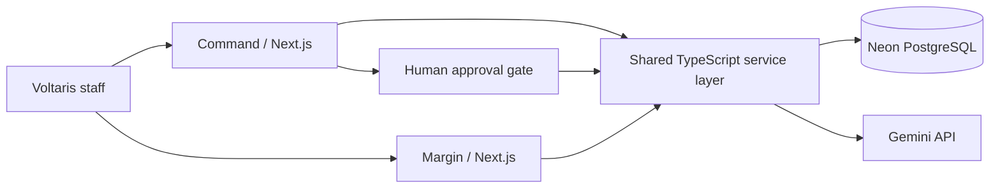

# Voltaris Energy — Command + Margin

Two connected operations products for a fictional European energy-services company. The company, sites, assets, people, and financial records are synthetic. The incident workflow, approvals, database writes, calculations, audit history, and AI calls run against real services.

## Products

| Product | User outcome | Main engineering work |
| --- | --- | --- |
| **Command** | Report an EV charger fault, review cited maintenance evidence, prepare a qualified technician dispatch, approve it, and complete a work order. | Grounded Gemini analysis, contract response targets, availability checks, transactional booking, staff authentication, audit trail. |
| **Margin** | Investigate regional service margin, drill into posted financial events, and see the forecast cost of approved open work. | PostgreSQL metrics, quarter comparison, keyset-paginated evidence, restricted AI explanations, actual-versus-forecast separation. |

The integration uses the same Postgres schema. Approving a Command proposal creates an open work order and a forecast event visible in Margin. Completion posts an actual cost event that changes the service margin. No forecast is counted as recognized revenue or actual cost.

## Architecture

The apps are separate Next.js projects in one pnpm workspace. `packages/core` owns domain types, authenticated staff sessions, database access, Command state transitions, Margin calculations, and the Gemini adapter. `database/migrations` and `database/seed.sql` define the schema and fictional starting records.

## Operational safeguards

- AI findings cite exact runbook, maintenance-log, or contract IDs. Unsupported citations are rejected.
- The model never emits SQL that is executed. Margin only runs fixed, parameterized queries.
- Dispatch remains a proposal until a signed-in staff member approves it. Slot booking, work-order creation, forecast posting, and audit entries commit in one transaction.
- Contract response risk is displayed when no qualified slot meets the deadline; the system does not claim an SLA was met.
- The app does not remotely control chargers or advise untrained users to perform electrical work.
- Actual margin is calculated only from posted recognized-revenue and actual-cost events. Backlog is labeled as forecast.
- Secrets are server-side environment variables. `.env.local` is ignored by Git.

## Local setup

Requires Node.js 22+, pnpm, a PostgreSQL database, and a Gemini API key.

1. `pnpm install`
2. Copy `.env.example` to `.env.local` and fill `DATABASE_URL`, `GEMINI_API_KEY`, `SESSION_SECRET`, `ADMIN_EMAIL`, and `ADMIN_PASSWORD`. Copy the same server-side values to `apps/command/.env.local` and `apps/margin/.env.local` for local Next.js runs.
3. `pnpm db:migrate`
4. `pnpm db:seed`
5. In separate terminals: `pnpm dev:command` and `pnpm dev:margin`.

Command runs on port 3000; Margin runs on port 3001. The first admin is created by the seed script. Use fictional data only. Running the seed repeatedly may add time-relative availability slots; it does not replace existing staff passwords.

## Verification

- `pnpm typecheck`
- `pnpm build`
- `pnpm test`
- From `packages/core`, `./node_modules/.bin/tsx src/smoke.ts` runs a **write-bearing** integration test against the configured database. It creates a QA incident and completes it. Run only on a database intended for testing.

The browser-level release checklist is in [the walkthrough](docs/WALKTHROUGH.md). Architecture and decisions are in [the case study](docs/CASE_STUDY.md).

## Scope

This is a functional employer portfolio product on fictional data. It is not connected to a real utility's field devices, ERP, CRM, Gmail, or Google Calendar. Scheduling uses the app's own persisted technician availability. Real customer deployment would require tenant isolation, identity integration, data protection review, monitoring, and domain-specific safety sign-off.
