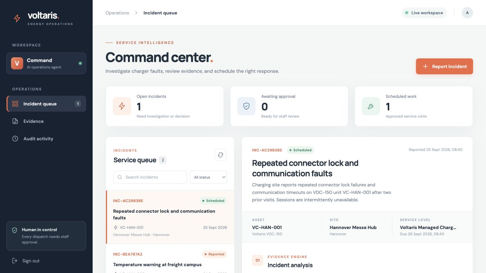
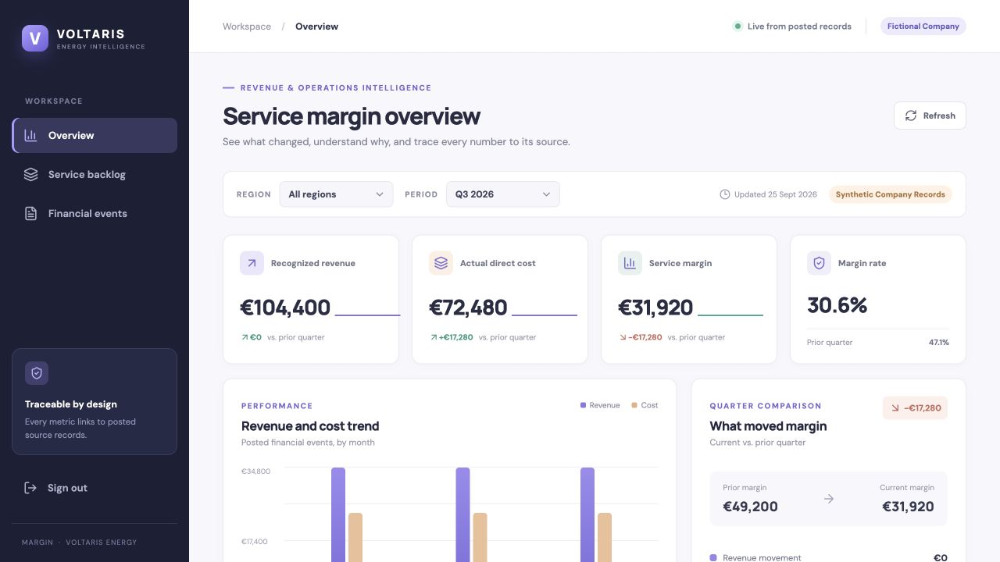
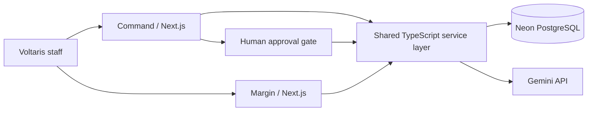

# Voltaris Energy — Site + Command + Margin

A public product website and two connected operations products for a fictional European energy-services company. The company, sites, assets, people, and financial records are synthetic. The incident workflow, approvals, database writes, calculations, audit history, and AI calls run against real services.

## Live products

| Product | Production URL |
| --- | --- |
| **Public site** | https://voltaris-energy-platform-site.vercel.app/ |
| **Command** | https://voltaris-energy-platform-command.vercel.app/ |
| **Margin** | https://voltaris-energy-platform-margin.vercel.app/ |

Command and Margin accept the same Voltaris staff credentials; each address has its own sign-in. Invited reviewers receive a private, writable workspace with an incoming fault, an already approved work order, and an explicit reset. Credentials are shared privately and never stored in the repository. Start with [the public website](apps/site/README.md) or [the reviewer guide](docs/REVIEWER_GUIDE.md).

[Watch the 90-second captioned product walkthrough](docs/voltaris-walkthrough.mp4) · [Read the case study](docs/CASE_STUDY.md)

[Reviewer and operator guide](docs/REVIEWER_GUIDE.md) · [Product upgrade plan](docs/UPGRADE_PLAN.md)

| Command incident workflow | Margin financial intelligence |
| --- | --- |
|  |  |

## Products

| Product | User outcome | Main engineering work |
| --- | --- | --- |
| **Command** | Report an EV charger fault, review cited maintenance evidence, prepare a qualified technician dispatch, approve it, and complete a work order. | Grounded Gemini analysis, contract response targets, availability checks, transactional booking, staff authentication, audit trail. |
| **Margin** | Investigate regional service margin, drill into posted financial events, and see the forecast cost of approved open work. | PostgreSQL metrics, quarter comparison, keyset-paginated evidence, restricted AI explanations, actual-versus-forecast separation. |

The products read the same PostgreSQL data within the signed-in workspace. Each invited reviewer has an isolated schema. Approving a Command proposal creates an open work order and a forecast event visible in Margin. Completion posts an actual cost event that changes service margin. No forecast is counted as recognized revenue or actual cost.

## Architecture

```mermaid
flowchart LR
  Staff[Voltaris staff] --> C[Command / Next.js]
  Staff --> M[Margin / Next.js]
  C --> Core[Shared TypeScript service layer]
  M --> Core
  Core --> N[(Neon PostgreSQL)]
  Core --> G[Gemini API]
  C --> A[Human approval gate]
  A --> Core
```

The apps are separate Next.js projects in one pnpm workspace. `packages/core` owns domain types, authenticated staff sessions, database access, Command state transitions, Margin calculations, and the Gemini adapter. `database/migrations` and `database/seed.sql` define the schema and fictional starting records.

## Operational safeguards

- Each AI cause or check cites its own exact runbook, maintenance-log, or contract IDs. Unsupported claims are discarded; an uncertain source review remains available.
- Invited reviewer records are isolated by account-owned PostgreSQL schema, with explicit reset, expiry, and a daily AI-call limit.
- The model never emits SQL that is executed. Margin only runs fixed, parameterized queries.
- Dispatch remains a proposal until a signed-in staff member approves it. Slot booking, work-order creation, forecast posting, and audit entries commit in one transaction.
- Contract response risk is displayed when no qualified slot meets the deadline; the system does not claim an SLA was met.
- The app does not remotely control chargers or advise untrained users to perform electrical work.
- Actual margin is calculated only from posted recognized-revenue and actual-cost events. Backlog is labeled as forecast.
- Secrets are server-side environment variables. `.env.local` is ignored by Git.

## Local setup

Requires Node.js 22+, pnpm, a PostgreSQL database, and a Gemini API key.

1. `pnpm install`
2. Copy `.env.example` to `.env.local` and fill `DATABASE_URL`, `GEMINI_API_KEY`, `SESSION_SECRET`, `ADMIN_EMAIL`, and `ADMIN_PASSWORD`. Copy the same server-side values to `apps/command/.env.local` and `apps/margin/.env.local` for local Next.js runs.
3. `pnpm db:migrate`
4. `pnpm db:seed`
5. In separate terminals: `pnpm dev:command`, `pnpm dev:margin`, and `pnpm dev:site`.

Command runs on port 3000; Margin runs on port 3001; the public site runs on port 3002 and does not need database secrets. The first admin is created by the seed script. Use fictional data only. Running the seed repeatedly may add time-relative availability slots; it does not replace existing staff passwords.

## Verification

- `pnpm typecheck`
- `pnpm build`
- `pnpm test`
- `pnpm test:e2e` against a seeded disposable database and running builds; see [the reviewer guide](docs/REVIEWER_GUIDE.md).
- From `packages/core`, `./node_modules/.bin/tsx src/smoke.ts` runs a **write-bearing** integration test against the configured database. It creates a QA incident and completes it. Run only on a database intended for testing.

CI runs the release gate against an isolated pgvector Postgres service. The browser-level walkthrough is in [the reviewer guide](docs/REVIEWER_GUIDE.md). Architecture and decisions are in [the case study](docs/CASE_STUDY.md).

## Scope

These are working internal operations products for a fictional company. They are not connected to a real utility's field devices, ERP, CRM, Gmail, or Google Calendar. Scheduling uses persisted technician availability. Real customer deployment would require enterprise identity and tenant policies, external integrations, data protection review, monitoring alerts, and domain-specific safety sign-off.
